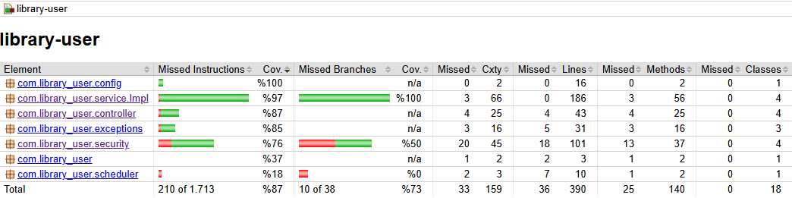
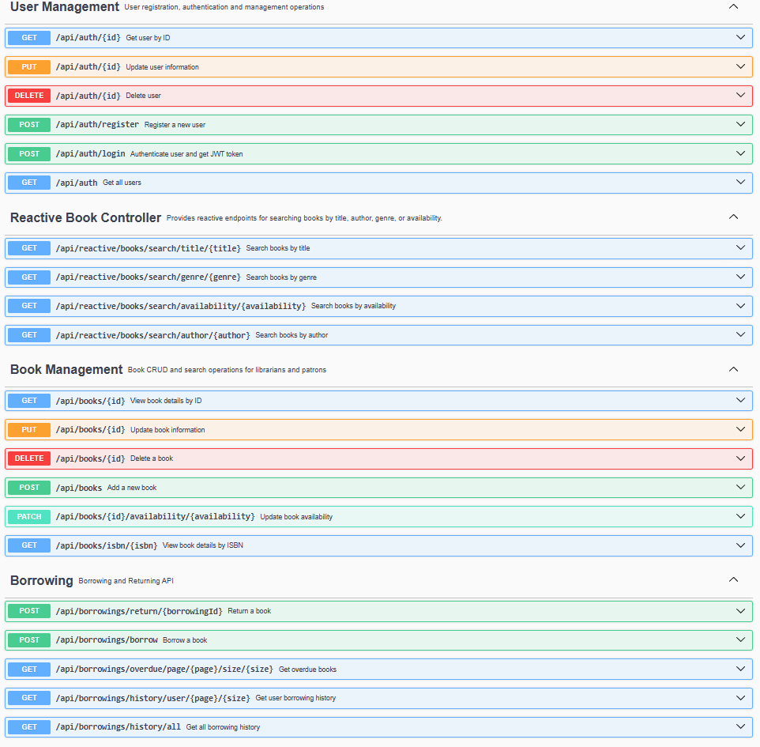
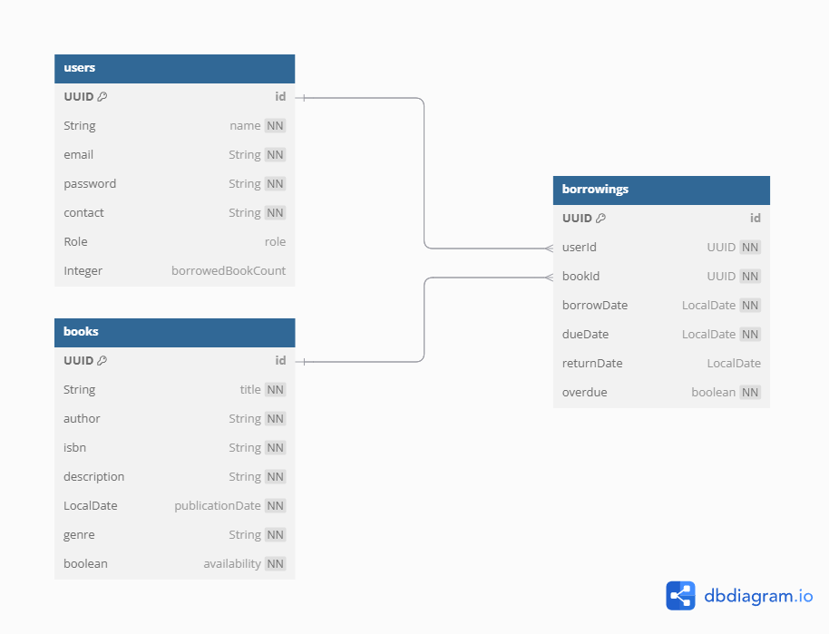

# Project Overview

This project is a comprehensive Library Management System designed to streamline library operations. It allows librarians to manage books and users, and oversee borrowing and returning processes. Patrons can easily search for books, view details, and manage their borrowing activities. The system is built using a modern technology stack including Spring Boot 3, Java 21, and PostgreSQL, ensuring robustness, scalability, and security. Key aspects include RESTful API design, comprehensive testing, and role-based access control.

## Tech Stack
- Java 21
- Spring Boot 3
- Swagger / OpenAPI
- Docker, Docker Compose
- Spring WebFlux

## RESTful API
- All functionalities are exposed through a well-defined RESTful API using appropriate HTTP methods and status codes.

## Database
- Utilizes PostgreSQL as the relational database with data persistence managed by Spring Data JPA and Hibernate.

## Security
- User authentication implemented using Spring Security and JSON Web Tokens (JWT).
- Role-based authorization to restrict access to functionalities based on user roles (librarian or patron).

## Testing
- Comprehensive unit tests and integration tests developed using Spring Boot Test.
- In-memory H2 database used for testing environments.
- Code coverage is monitored using JaCoCo. Below is a summary of the test coverage:




## API Documentation
- Full API documentation is available via Swagger UI.
- Access the Swagger UI: http://localhost:8080/swagger-ui/index.html
- Here's a preview of the Swagger UI interface:



## Version Control
- Git is used for version control, with the project on GitHub repository.

## Build Tool
- Built using Maven.

## Logging
- Comprehensive logging mechanism implemented using SLF4J to track important events, errors, and application flow for debugging.

## Dockerization
- Application containerized using Docker and Docker Compose for easy deployment and scalability.

## Reactive Programming
- Search books using Spring WebFlux


## Running the Application Locally

### Method 1: Without Docker

1.1  Clone the Repository :
- git clone https://github.com/brksnr/library-user

1.2  Configure Database :
- Ensure PostgreSQL is running.
- Update src/main/resources/application.properties with your PostgreSQL URL, username, and password.

1.3  Build and Run :
- Using Maven:
- mvn clean install
- mvn spring-boot:run

1.4  Access :
- The application will be available at http://localhost:8080 or your configured port.
- API docs: http://localhost:8080/swagger-ui.html

-------------------------------------------------------------------------------------------

### Method 2: With Docker

2.1  Clone the Repository :
- git clone https://github.com/brksnr/library-user

2.2  Start Docker & Run:
- Ensure Docker Desktop is running. In the project root directory, execute:
- docker-compose up --build

3.3  Access :
- The application will be available at http://localhost:8080 or your configured port.
- API docs: http://localhost:8080/swagger-ui.html

## Database Schema
Below is the Entity Relationship Diagram (ERD) for the Library Management System:



## Main Endpoints

Add new books with detailed information (title, author, ISBN, publication date, genre) and data validation :
* <mark>POST /api/books</mark>

Body :
```json

  "title": "title",
  "author": "author",
  "isbn": "00000000000",
  "description" : "description",
  "publicationDate": "2025-05-14",
  "genre": "genre",
  "availability" : true
```

View detailed information for any book :
* <mark>GET /api/books/{id}</mark>

Search for books by title, author, ISBN, or genre with paginated results :
* <mark>GET /api/reactive/books/search/title/{title}?page={page}&size={size} (Reactive)</mark>
* <mark>GET /api/reactive/books/search/author/{author}?page={page}&size={size} (Reactive)</mark>
* <mark>GET /api/reactive/books/search/genre/{genre}?page={page}&size={size} (Reactive)</mark>
* <mark>GET /api/reactive/books/search/availability/{availability}?page={page}&size={size} (Reactive)</mark>
* <mark>GET /api/books/isbn/{isbn}</mark>

Update existing book information :
* <mark>PUT /api/books/{bookId}</mark>

Body :
```json

  "title": "title",
  "author": "author",
  "isbn": "00000000000",
  "description" : "description",
  "publicationDate": "2025-05-14",
  "genre": "genre",
  "availability" : true
```
Delete books from the system :
* <mark>DELETE /api/books/{bookId}</mark>

User registration for both patrons and librarians with personal details :
* <mark>POST /api/auth/register</mark>

Body :
```json

    "name": "name",
    "email": "email@example.com",
    "password": "password",
    "contact": "000-000-00-00",
    "role": "LIBRARIAN"

```

View detailed all user information (librarian access) :
* <mark>GET /api/auth</mark>

Update user information (librarian access) :
* <mark>PUT /api/auth/{userId}</mark>

Body:
```json
    "name": "update name",
    "email": "updatename@example.com",
    "password": "updatepasswrod",
    "contact": "111-111-11-11",
    "role": "LIBRARIAN"
    "borrowedBookCount" : 0
```

Delete users from the system (librarian access) :
* <mark>DELETE /api/auth/{userId}</mark>

Patrons can borrow available books :
* <mark>POST /api/borrowings/borrow</mark>

Body :
```json
    "userId" : "userId",
    "bookId" : "bookId"
```

Patrons can return borrowed books, updating availability and records :
* <mark>PUT /api/borrowings/return/{borrowingId}</mark>

Patrons can view their personal borrowing history :
* <mark>GET /api/borrowings/history/user/{page}/{size} (with token)</mark>

Librarians can view the borrowing history of all users : 
* <mark>GET /api/borrowings/history/all (with token)</mark>

Librarians can see reports for overdue books :
* <mark>GET /api/borrowings/overdue/page/{page}/size/{size}</mark>


## API Collection

A Postman collection with all API endpoints pre-configured is available to facilitate testing and interaction with the API. The collection is organized logically by feature.

**How to use:**

1.  Download the collection file from the repository:
    * [Library Management API Postman Collection](./postman/Library_Managment.postman_collection.json)
2.  Open Postman.
3.  Click on the "Import" button (usually found in the top-left corner).
4.  Drag and drop the downloaded `.json` file or select it using the file browser.
5.  Once imported, you will find the "library-management" collection in your Postman workspace, with all the requests grouped by functionality.

Make sure your application is running locally before sending requests from Postman.
